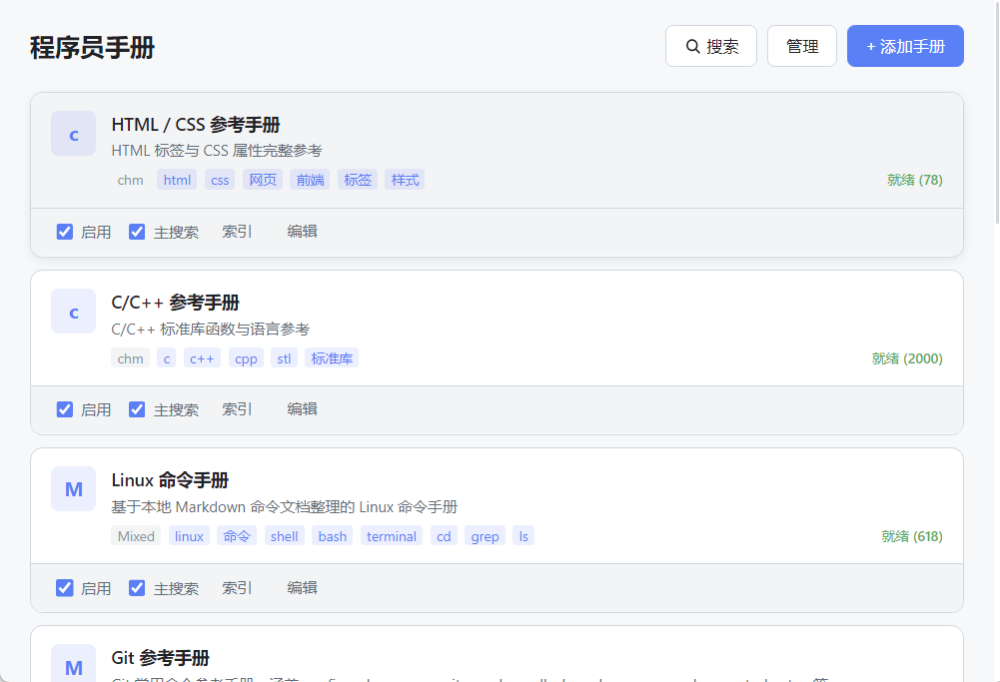
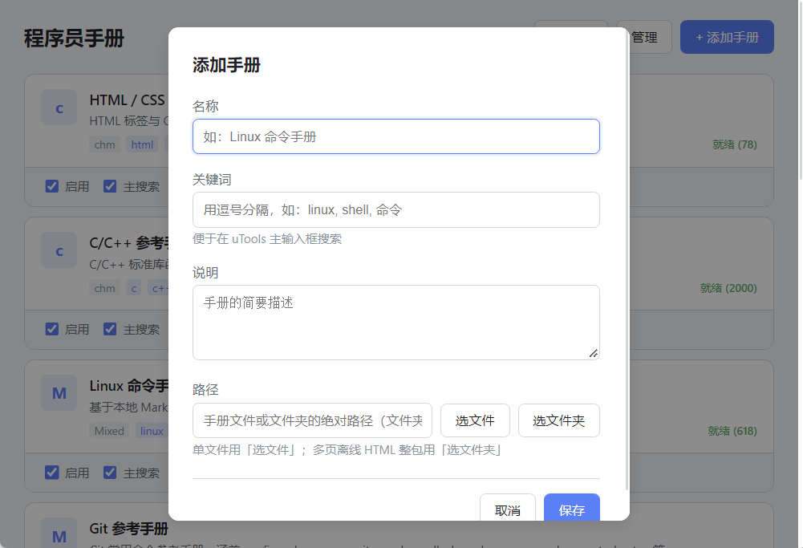
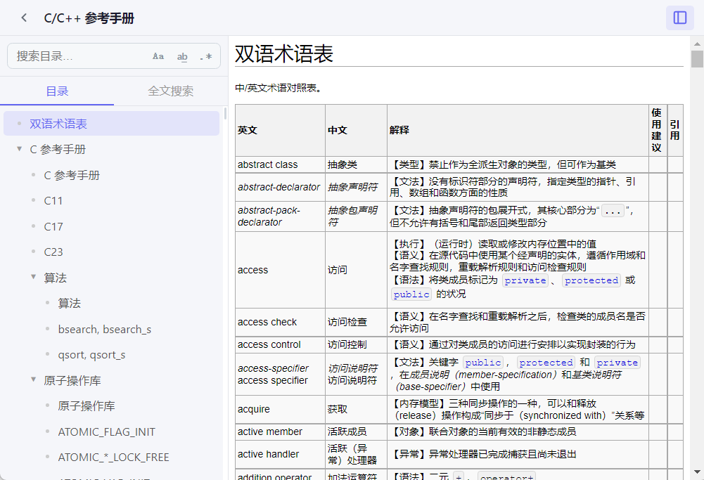
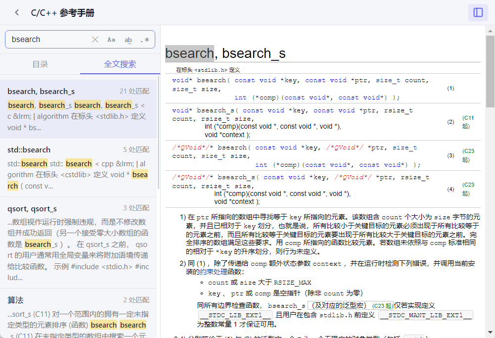

# 猿手册（uTools 插件）

面向程序员与写代码场景的**本地技术手册**阅读与全文检索工具，以 uTools 插件形式运行。  
远程仓库：<https://github.com/MXS81/Procedur_Manual>

**开源协议**：[MIT](./LICENSE)（仅针对本仓库**源代码**；内置文档资料见 [版权声明](./版权声明.md)。）

---

## 作者说明

学编程时，我在 uTools 里接触到「程序员手册」这类工具——写代码时能很快查函数用法、命令说明，非常省事。当时个人感觉生态里自定义手册的入口有时比较单一，也较长时间没有更新，而自己也想把手头的 **Markdown、CHM、PDF、离线 HTML 整包** 都纳进来，于是在学习过程中借助 AI搭了现在这个插件；开发以解决自己碰到的 bug 与需求为主，没有做过完整、系统的测试。

仓库里的内置手册与示例资源多为网上搜集，难免有缺口或版本偏旧，授权与准确性也无法由作者一人保证（详见 [版权声明](./版权声明.md)）。因此选择开源：欢迎一起改代码、补测试、精简或替换手册、完善文档——比单打独斗靠谱得多。

搜集资料时，遇到过一些值得推荐的网站与工具，感兴趣可以了解：

| 名称 | 说明 |
|------|------|
| [iTbook.team 技术速查手册](https://www.dba.cn/book/) | 在线中文技术文档聚合，分类多、便于当索引与速查入口。 |
| [Zeal](https://github.com/zealdocs/zeal) | 受 Dash 启发的离线文档浏览器（，可管理 docset；与本 uTools 插件场景不同，但可互补。 |

**说明**：当前本插件在「添加手册」中已支持 **HTML / Markdown / JSON / PDF / CHM** 及**目录型**文档等多种形态（亦可通过 uTools 文件场景导入），具体以 `public/plugin.json` 与界面为准；上文关于「JSON」的感受仅反映本人**初学阶段**对个别工具的印象，避免与现状混淆。

---

## 界面截图

| 手册库主页 | 手册添加 |
|:---:|:---:|
|  |  |

| 目录树与正文| 关键词高亮与结果列表 |
|:---:|:---:|
|  |  |

---

## 开源方案与 uTools 发布要点

### 1. 协议选择

- 建议采用 **MIT**；修改后需**保留原作者版权声明**（见 `LICENSE`）。
- **注意区分**：`LICENSE` 只覆盖你写的代码；`public/builtin-manuals/` 内第三方文档的版权仍归各自权利人（见 `版权声明.md`）。

### 2. 代码与数据安全

- **勿将** API Key、Token、私钥写入 `package.json`、源码或已跟踪的配置文件；若将来需要密钥，使用 **`.env`**（已列入 `.gitignore`），并在 **`.env.example`** 中只写变量名与说明。
- 本仓库已检查依赖与脚本中无需提交的硬编码密钥；协作前请自行再扫一遍 diff。
- **用户数据**：手册列表、索引等由 uTools / 插件在本机读写，设计上不依赖项目方服务器；请勿在 issue/PR 中粘贴他人隐私路径或文档内容。

### 3. 安装包分发（Releases）

- 推荐在 **GitHub Releases** 上传 **`dist` 打包后的 `.upxs`**，可以使用UTools的开发者工具插件进行离线打包，便于用户直接安装。
- 同时保留本 README 中的 **构建步骤**，方便从源码自行 `npm run build`。
- 发版时可在 Release 说明中写明：**对应 commit**、**已测 uTools 版本**、**体积与已知问题**。

### 4. 协作与文档

- **Issue**：描述现象、uTools 版本、操作系统、复现步骤；若与某本内置手册有关，注明手册名称即可，勿上传整本受版权保护的内容。
- **Pull Request**：小步提交、说明动机；合并前请本地执行 `npm run build` 通过。
- **界面截图**：见本文上方「界面截图」；源文件位于 `docs/screenshots/`，便于 uTools 市场审核与新人了解功能。

### 5. uTools 兼容与官方市场

- **兼容版本**：请在实际测试后于本段或 Release 中维护一句，例如「已在 uTools x.x.x + Windows 10/11 验证」。*（维护者随发布更新。）*
- uTools **不禁止**将插件开源到 GitHub；若符合规范，可申请进入 **uTools 插件市场** 以获得曝光（以官方当时规则为准）。


## 主要功能

- **手册库**：浏览已添加的内置手册与用户导入的手册，支持启用/禁用、管理（含批量删除等）。
- **全文搜索**：跨手册检索关键词；支持为 PDF 等构建本地索引（大 PDF 索引进度可显示）。
- **多格式阅读**  
  - **Markdown / HTML / JSON**：内置渲染与高亮（Markdown 等）。  
  - **PDF**：使用 pdf.js 在页面内渲染（不依赖系统 PDF 插件）；中文等字体依赖 CMap（默认从 CDN 加载，需网络或代理）。  
  - **CHM**：解压后阅读；部分 CHM 无 `.hhc` 时侧栏可能无目录，请用全文搜索。  
  - **目录型站点**：整站 HTML（如带 `index.html` 的文档站）可用入口页在 iframe 中浏览。  
  - **混合目录**：无单一入口时，以文件列表方式浏览目录内文档。
- **导入本地文件**：通过 uTools 场景（如「导入手册」）选择 `.html` / `.htm` / `.md` / `.markdown` / `.json` / `.pdf` / `.chm` 等加入库中。
- **内置 7-Zip 工具链**：用于 CHM 等解压（见 `public/tools` 与构建脚本说明）。

插件内功能入口以 uTools 中配置的 **关键字与场景** 为准（见 `public/plugin.json` 的 `features`）。

---

## 开源与贡献

- 欢迎 **Issue**、**Pull Request**、**Fork**；动机与作者背景见「项目缘起与作者说明」，流程与协议见「开源方案与 uTools 发布要点」。
- 文档纠错、README、内置手册元数据（`build-builtin-manifest.mjs`）、测试与手册版权合规等，都欢迎参与。

---

## 如何添加 / 调整「内置手册」

内置手册资源放在 **`public/builtin-manuals/`** 下，条目登记在 **`manifest.json`**。

### 方式 A：改清单脚本（推荐，避免编码问题）

1. 将文件或目录放到 `public/builtin-manuals/`（例如 `my-manual/` 或 `xxx.chm`）。  
2. 编辑 **`scripts/build-builtin-manifest.mjs`**：在数组 `BUILTIN_MANUALS` 中增加一项，字段与现有条目一致：  
   - `id`：唯一字符串，建议 `builtin-` 前缀。  
   - `name` / `description` / `keywords`：展示与搜索用。  
   - `fileName`：相对 `public/builtin-manuals/` 的路径（如 `command` 表示目录，`xxx.chm` 表示单文件）。  
   - 若为整站 HTML，可设 `entryFile`（如 `index.html`）。  
   - `version`：版本号字符串。  
3. 执行 **`npm run build`**（会运行 `build-builtin-manifest.mjs` 并重新生成 `public/builtin-manuals/manifest.json`）。

### 方式 B：直接改 manifest

1. 同样先把资源放进 `public/builtin-manuals/`。  
2. 直接编辑 **`public/builtin-manuals/manifest.json`**，按现有 JSON 结构追加对象。  
3. 若之后执行 **`npm run build`**，且构建里包含 `build-builtin-manifest.mjs`，则 **manifest 会被脚本覆盖**；长期使用建议以 **方式 A** 为准，或从构建命令中临时去掉 manifest 生成步骤。

> **注意**：大体积二进制（PDF、CHM、整站 HTML）会显著增大插件包；版权与授权请自行合规（见下文版权声明）。

---

## 当前内置手册一览

以下与 `public/builtin-manuals/manifest.json` 一致（名称以清单为准）：

| 名称 | 类型说明 | `fileName`（相对 `builtin-manuals/`） |
|------|-----------|----------------------------------------|
| Linux 命令手册 | Markdown 目录 | `command/` |
| HTML / CSS 参考手册 | CHM | `html-css-reference.chm` |
| JavaScript 参考手册 | CHM | `javascript-reference.chm` |
| Python 参考手册 | CHM | `python-reference.chm` |
| Python 3.13.x 核心参考与实例手册 v1.10 | CHM | `Python 3.13.x 核心参考与实例手册 v1.10.chm` |
| C/C++ 参考手册 | CHM | `cppreference-zh_CN.chm` |
| Java 参考手册 | CHM | `java-reference.chm` |
| MATLAB 参考手册 | CHM | `matlab-reference.chm` |
| SQL 参考手册 | CHM | `sql-reference.chm` |
| MySQL 8.0 中文参考手册 | CHM | `MYSQL8.0中文参考手册.chm` |
| Git 参考手册 | Markdown 目录 | `git/` |
| PHP 参考手册 | 整站 HTML（`entryFile`: `index.html`） | `php-chunked-xhtml/` |
| JavaScript 核心参考手册 | CHM | `JS参考手册集合/JavaScript核心参考手册.chm` |
| 微软 JavaScript 手册 | CHM | `JS参考手册集合/微软JavaScript手册js.chm` |
| JavaScript 语言中文参考手册 | CHM | `JS参考手册集合/JavaScript语言中文参考手册.chm` |
| Vim 手册中文版 7.2 | CHM | `Vim手册中文版7.2.chm` |
| Vue.js 官方离线文档（PDF） | PDF | `VueJS官方离线文档(搬运版).pdf` |

实际磁盘上须存在与 `fileName` 对应的文件或目录，否则插件内无法打开该项。

---

## 版权声明

**资料搜集自网络，若有侵权，联系删除。** 详见仓库根目录 [`版权声明.md`](./版权声明.md)。

---

## 开发

```bash
npm install
npm run dev
```

本地开发时 uTools 可通过 `plugin.json` 的 `development.main` 指向 Vite 开发地址（若已配置）。

## 构建（发布到 uTools）

```bash
npm run build
```

产物在 **`dist/`**，用于在 uTools 中加载或打包为插件。

## 技术栈

React 19、Vite 6、Minisearch、Marked、DOMPurify、Highlight.js、pdf.js（PDF 阅读）、preload 端 Node 能力（文件读写、CHM/PDF 索引等）；依赖见 `package.json` 与 `public/preload/package.json`。
